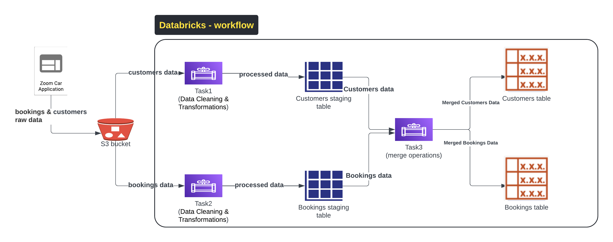

**Project Overview: Zoom Car Bookings and Customers Data Processing**

This project aims to automate the processing of car booking and customer data using PySpark in a Databricks environment. The workflow includes data ingestion from JSON files stored in Google Cloud Platform (GCP), data cleaning and validation, transformations, and merging processed data into Delta tables.

**Objectives:**

1. **Data Ingestion**: Read daily JSON files containing car booking and customer information from a GCP storage bucket.
1. **Data Cleaning and Validation**: Ensure data quality by removing null values, validating formats, and checking against predefined statuses.
1. **Transformations**: Perform necessary transformations to enrich the data.
1. **Data Merging**: Update or insert records into the target Delta tables based on specific conditions.
1. **Automation**: Set up a Databricks job to automate the workflow for daily execution.

### Architecture Diagram

**Components of the Project**

1. **Dataset Structure**:
   1. **Car Bookings JSON**: Contains booking records with fields such as booking\_id, customer\_id, car\_id, booking\_date, start\_time, end\_time, total\_amount, and status.
   1. **Customers JSON**: Contains customer records with fields such as customer\_id, name, email, phone\_number, signup\_date, and status.
1. **Python Script for Mock Data Generation**:
   1. A Python script to generate multiple mock JSON files for car bookings and customers, based on the specified format and sample data.
1. **PySpark Notebooks**:
   1. **Notebook 1: Process Zoom Car Bookings**:
      1. Read the daily JSON file.
      1. Clean and validate data (removing nulls, validating dates, and checking status).
      1. Transform data by parsing date and time, calculating booking duration, and load into staging\_bookings\_delta.
   1. **Notebook 2: Process Zoom Car Customers**:
      1. Read the daily JSON file.
      1. Clean and validate customer data (removing nulls, validating emails, and checking status).
      1. Transform data by normalizing phone numbers and calculating customer tenure, then load into staging\_customers\_delta.
   1. **Notebook 3: Merge Data**:
      1. Read cleaned and validated data from staging tables.
      1. Merge into target Delta tables based on booking and customer IDs, handling updates, inserts, and deletions as specified.
1. **Databricks Job Workflow**:
   1. Automate the execution of the notebooks in sequence:
      1. Step 1: Trigger the bookings processing notebook.
      1. Step 2: Trigger the customers processing notebook.
      1. Step 3: Trigger the merging data notebook.
   1. The workflow should accept the current date as a parameter for reading the corresponding JSON files.

**Deliverables**

- **Sample JSON Files**: Provide example files for both car bookings and customers.
- **PySpark Notebooks**: Implemented notebooks for processing bookings, customers, and merging data.
- **Databricks Job Configuration**: JSON configuration for automating the workflow in Databricks.

**Implementation Steps**

1. **Data Generation**: Create the mock data scripts to generate sample JSON files.
1. **Develop Notebooks**: Build the required PySpark notebooks with data validation, transformation, and merging logic.
1. **Test Notebooks**: Ensure each notebook works as expected with the sample data.
1. **Setup Databricks Job**: Configure the job in Databricks to run the notebooks in the correct sequence.
1. **Documentation**: Document the process, including setup instructions and a description of each notebook.

**Conclusion**

This project will enhance the efficiency of processing car booking and customer data, ensuring data integrity and enabling easy access for analytical purposes. The automation of the workflow will allow for daily updates with minimal manual intervention, streamlining operations within the organization

